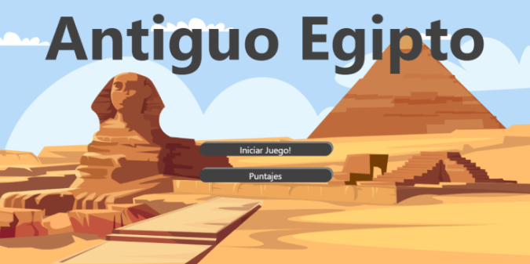
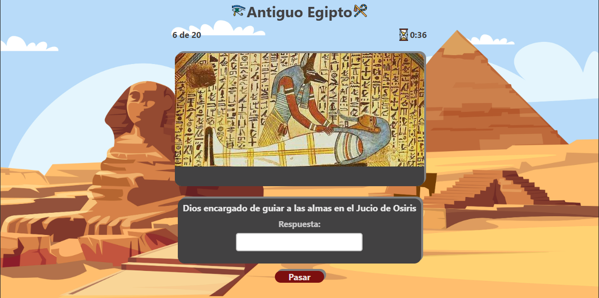
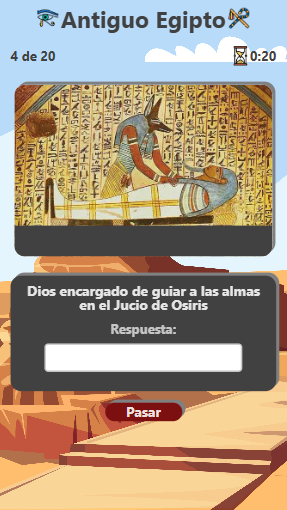

# 🎮 Egipto Games - Aprende Jugando

¡Bienvenidos a **Egipto Games**, la plataforma interactiva donde los estudiantes de secundaria pueden aprender sobre la fascinante cultura egipcia mientras se divierten! Este sitio web está diseñado para ofrecer a los alumnos una manera divertida y educativa de sumergirse en el mundo de Egipto, todo mientras juegan y descubren.

## 🚀 Características

- 🎮 **Juegos educativos**: Los estudiantes pueden aprender sobre la historia, mitología, y cultura egipcia mientras juegan.
- 📚 **Diseño interactivo**: Una experiencia de juego que hace más divertido aprender.
- 📍 **Para estudiantes de secundaria**: Contenidos adaptados para jóvenes, con un enfoque en la educación.
- 🌍 **Diseño responsivo**: Funciona perfectamente en cualquier dispositivo, ya sea en computadora, tablet o teléfono.
- 🏆 **Desafíos y recompensas**: Los jugadores pueden superar desafíos y ganar recompensas, lo que mantiene la motivación para seguir aprendiendo.

## 🖥️ Demo en Producción

🔗 [**Accede a la App**](https://egipto-games.vercel.app/)

## 🛠️ Tecnologías utilizadas

- **React**: Para una interfaz de usuario dinámica y fluida.
- **Vite**: Para un entorno de desarrollo rápido y eficiente.
- **CSS**: Estilos simples para hacer la experiencia visualmente atractiva.
- **JavaScript**: Para la lógica del juego y las interacciones.

## 🎯 Objetivo Educativo

El principal objetivo de **Egipto Games** es proporcionar a los estudiantes de secundaria una forma entretenida de aprender sobre la historia de Egipto, su mitología, arquitectura y cultura. A través de juegos interactivos, los alumnos pueden disfrutar mientras desarrollan habilidades de pensamiento crítico y resolución de problemas.
